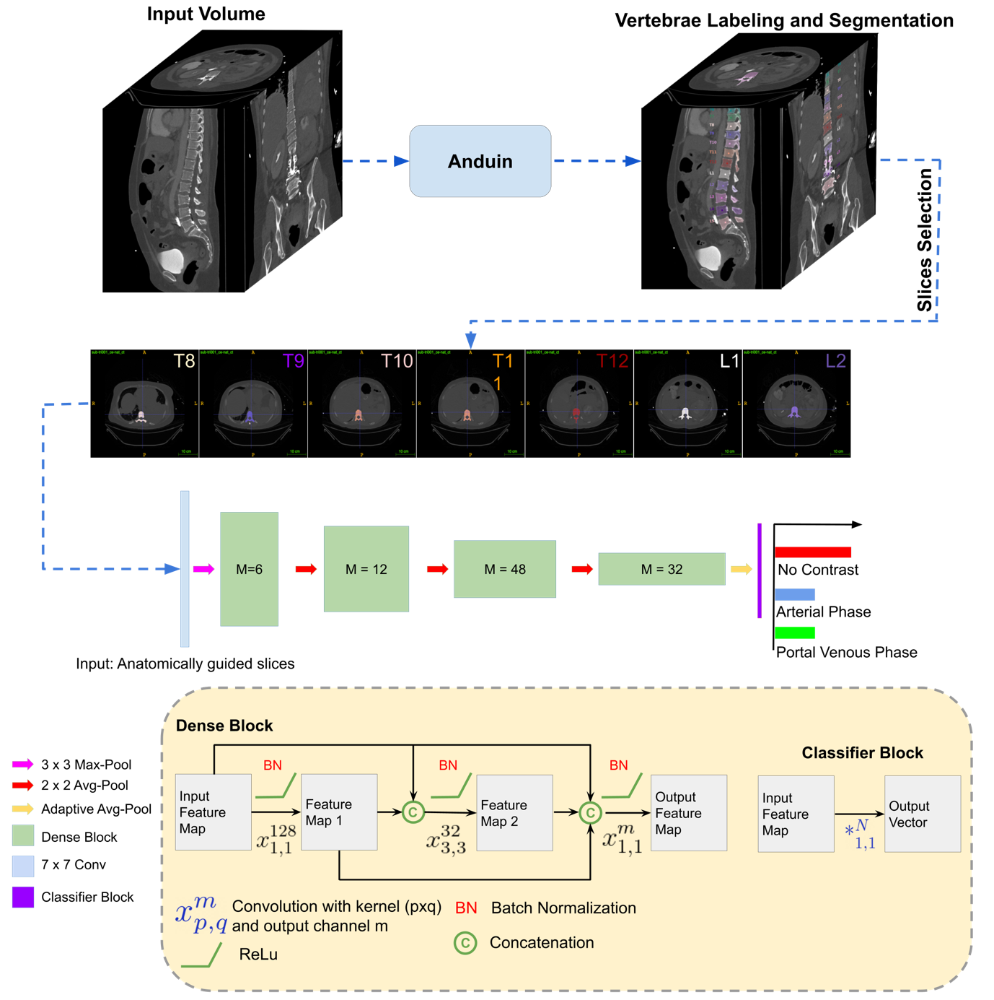

#Automated detection of the contrast phase in MDCT by an artificial neural network improves accuracy of opportunistic bone mineral density measurements

Source code for our paper "Automated detection of the contrast phase in MDCT by an artificial neural network improves accuracy of opportunistic bone mineral density measurements" as described  in **Jounal of Europena Radiology**.

Authors: Sebastian Rühling, Fernando Navarro, 



## Getting Started
### Pre-requisites

You need to have following in order for this library to work as expected

1. python >= 3.6.5
2. pip >= 18.1
3. tensorflow-gpu = 1.9.0
4. tensofboard = 1.9.0
4. numpy >= 1.15.0
5. dipy >= 0.14.0
6. matplotlib>= 2.2.2
7. nibabel >= 1.15.0
8. pandas >= 0.23.4
9. scikit-image >= 0.14.0
10. scikit-learn >= 0.20.0
11. scipy >= 1.1.0
12. seaborn >= 0.9.0
13. SimpleITK >= 1.1.0
14. tabulate >= 0.8.2
15. xlrd >= 1.1.0

### Install requirements
Run `pip install -r requirements.txt`


## How to use the code for training

1. Download VerSe19 and Verse20 for sample data  [VerSe19](https://verse2019.grand-challenge.org/)  [VerSe20](https://verse2020.grand-challenge.org/).

2. Obtain Vertebrae Segmentations using [Anduin](https://anduin.bonescreen.de/).

3. Your data must be in the following structure:
```
└── data_folder
	├── raw_data
		├── patient001
			├── patient001_ct_image.nii.gz
	├── derivatives
		├── patient001
			├── patient001_seg-subreg_ctd.json
   
```

3. Convert your data into npz files before starting the training using the command:

```
python data2npz.py --data_folder ./data --dst_dolder ./npz_files
```

Script argments:
```

--data_folder ./data           Path to the model to the data folder containing NIfTI  files(default: ./data)
--task {play,eval,train}
                        task to perform, must load a pretrained model if task
                        is "play" or "eval" (default: train)
  --file_type {brain,cardiac,fetal}
                        Type of the training and validation files (default:
                        train)
  --files FILES [FILES ...]
                        Filepath to the text file that contains list of
                        images. Each line of this file is a full path to an
                        image scan. For (task == train or eval) there should
                        be two input files ['images', 'landmarks'] (default:
                        None)
  --val_files VAL_FILES [VAL_FILES ...]
                        Filepath to the text file that contains list of
                        validation images. Each line of this file is a full
                        path to an image scan. For (task == train or eval)
                        there should be two input files ['images',
                        'landmarks'] (default: None)
  --saveGif             Save gif image of the game (default: False)
  --saveVideo           Save video of the game (default: False)
  --logDir LOGDIR       Store logs in this directory during training (default:
                        runs)
  --landmarks [LANDMARKS [LANDMARKS ...]]
                        Landmarks to use in the images (default: [1])
  --model_name {CommNet,Network3d}
                        Models implemented are: Network3d, CommNet (default:
                        CommNet)
  --batch_size BATCH_SIZE
                        Size of each batch (default: 64)
  --memory_size MEMORY_SIZE
                        Number of transitions stored in exp replay buffer. If
                        too much is allocated training may abruptly stop.
                        (default: 100000.0)
  --init_memory_size INIT_MEMORY_SIZE
                        Number of transitions stored in exp replay before
                        training (default: 30000.0)
  --max_episodes MAX_EPISODES
                        "Number of episodes to train for" (default: 100000.0)
  --steps_per_episode STEPS_PER_EPISODE
                        Maximum steps per episode (default: 200)
  --target_update_freq TARGET_UPDATE_FREQ
                        Number of epochs between each target network update
                        (default: 10)
  --save_freq SAVE_FREQ
                        Saves network every save_freq steps (default: 1000)
  --delta DELTA         Amount to decreases epsilon each episode, for the
                        epsilon-greedy policy (default: 0.0001)
  --viz VIZ             Size of the window, None for no visualisation
                        (default: 0.01)
  --multiscale          Reduces size of voxel around the agent when it
                        oscillates (default: False)
  --write               Saves the training logs (default: False)
  --train_freq TRAIN_FREQ
                        Number of agent steps between each training step on
                        one mini-batch (default: 1)
  --seed SEED           Random seed for both training and evaluating. If none
                        is provided, no seed will be set (default: None)
```


4. Run the training script with the specified parameters:

```
python train_anatomy_guided.py --data_folder ./data --dst_dolder ./npz_files
```

## Inference

Run the command:
```
python infer_anatomy_guided.py --data_folder ./data --dst_dolder ./npz_files
```

## Parameters Usage


## License and Citation

Please cite our paper if it is useful for your research:

    
    @article{navarro2019shape,
    	title={Shape-Aware Complementary-Task Learning for Multi-Organ Segmentation},
    	author={Navarro, Fernando and Shit, Suprosanna and Ezhov, Ivan and Paetzold, Johannes and Gafita, Andrei and Peeken, Jan and Combs, Stephanie and Menze, Bjoern},
    	journal={arXiv preprint arXiv:1908.05099},
    	year={2019}
    }
    
## Code Authors

* **Fernando Navarro**  - [ferchonavarro](https://github.com/ferchonavarro)

## Help us improve
Let us know if you face any issues. You are always welcome to report new issues and bugs and also suggest further improvements. And if you like our work hit that start button on top. Enjoy :)